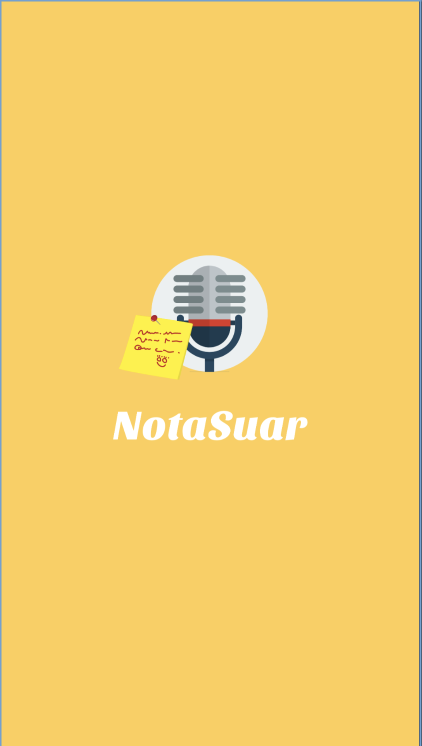
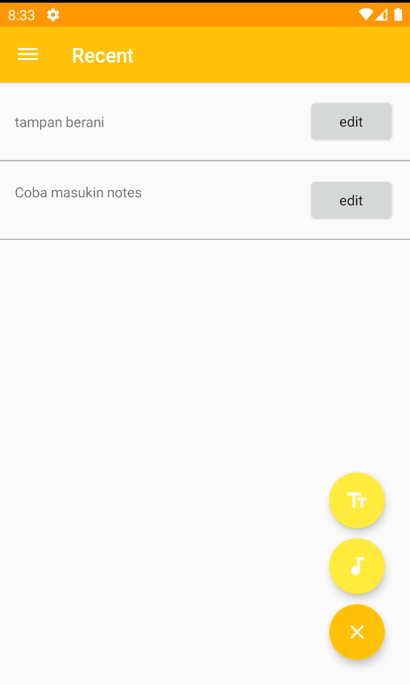
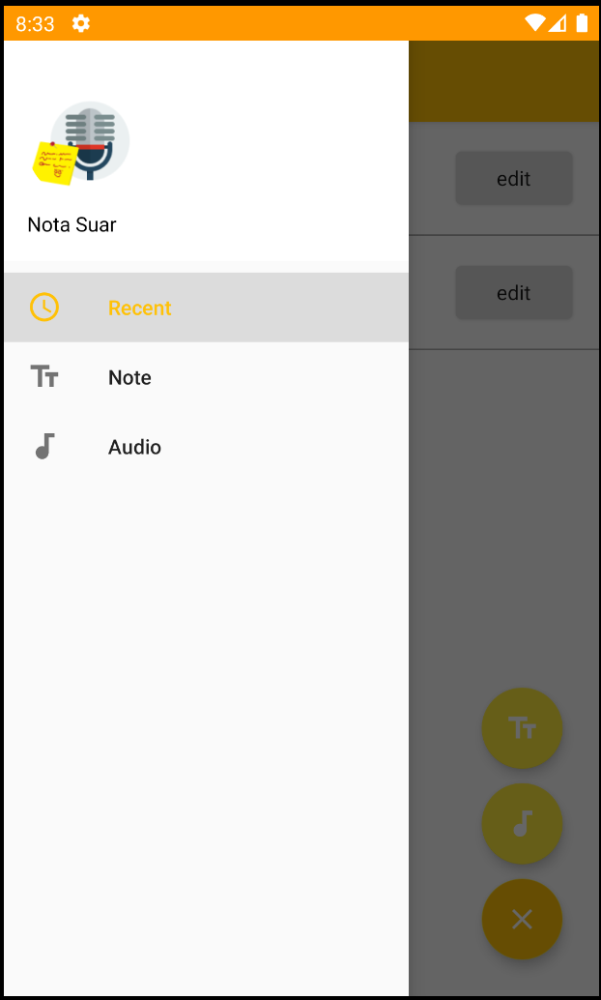

# Tugas Tengah Semester TKTPL
Tugas Tengah Semester Kelas Mobile Programming

## NOTA SUAR Mobile APP
Sebuah aplikasi sederhana yang bertujuan sebagai catatan yang mempunyai dua fungsi utama :
* Notes : Untuk menulis catatan sederhana
* AudioRecord : Untuk melakukan record suara jika ada hal penting yang ingin direkam

## Tampilan Aplikasi

  

